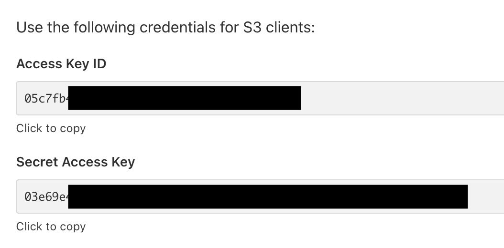
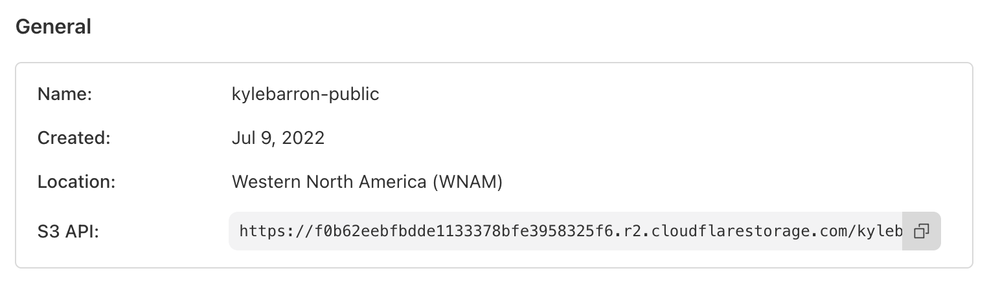

# Cloudflare R2

[Cloudflare R2](https://www.cloudflare.com/developer-platform/products/r2/) is Cloudflare's object storage solution, designed to be compatible with the S3 API. Some developers may choose to use Cloudflare R2 because it has no egress fees.

It's easy to read and write data to and from Cloudflare R2 with obstore's [`S3Store`][obstore.store.S3Store] with three steps:

1. [Create an API token](https://dash.cloudflare.com/?to=/:account/r2/api-tokens) with read or read/write access to one or more buckets.

    Copy the `Access Key ID` and `Secret Access Key` to use in your code.

    

2. On the general settings of a bucket, take note of the `S3 API` URL. In my case it's `https://f0b62eebfbdde1133378bfe3958325f6.r2.cloudflarestorage.com/kylebarron-public`.

    

3. Pass this information to [`S3Store.from_url`][obstore.store.S3Store.from_url]:

    ```py
    from obstore.store import S3Store

    access_key_id = "..."
    secret_access_key = "..."
    store = S3Store.from_url(
        "https://f0b62eebfbdde1133378bfe3958325f6.r2.cloudflarestorage.com/ kylebarron-public",
        access_key_id=access_key_id,
        secret_access_key=secret_access_key,
    )
    store.list_with_delimiter()
    ```

    Or you can construct a store manually with the `endpoint` and `bucket` parameters:

    ```py
    from obstore.store import S3Store

    access_key_id = "..."
    secret_access_key = "..."
    bucket = "kylebarron-public"
    endpoint = "https://f0b62eebfbdde1133378bfe3958325f6.r2.cloudflarestorage. com"
    store = S3Store(
        bucket,
        access_key_id=access_key_id,
        secret_access_key=secret_access_key,
        endpoint=endpoint,
    )
    store.list_with_delimiter()
    ```
